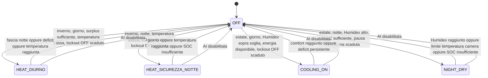

# AI Climate — State Machine Draft

## Guardie globali

Ogni transizione deve rispettare:

- tempo minimo di accensione;
- tempo minimo di spegnimento;
- watchdog di potenza reale;
- abilitazione generale AI;
- limiti energetici;
- vincoli di fascia oraria;
- eventuale modalità di grazia mattutina.
