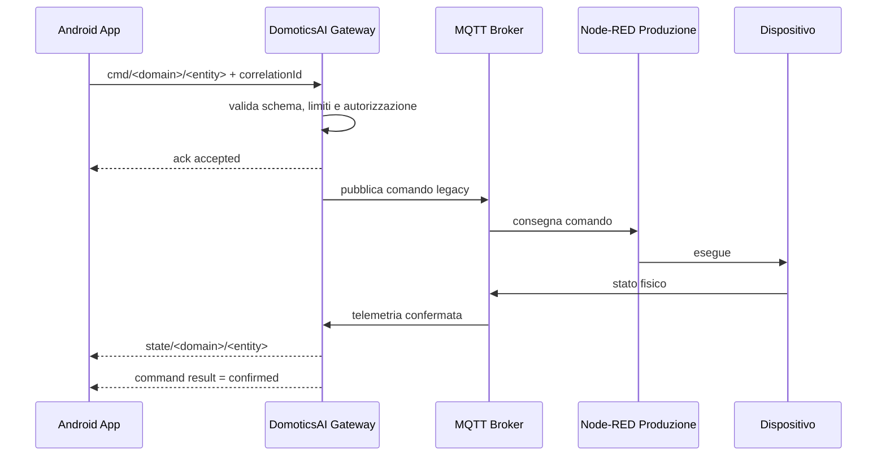

# Command Lifecycle — Draft v0.1



## Stati comando

- `accepted`
- `rejected`
- `sent`
- `confirmed`
- `timeout`
- `failed`

## Campi minimi

```json
{
  "commandId": "uuid",
  "timestamp": "ISO-8601",
  "domain": "climate",
  "entity": "enabled",
  "requestedValue": true,
  "status": "accepted",
  "source": "android"
}
```
