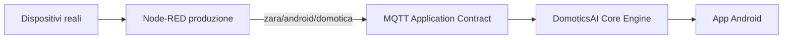

# DomoticsAI — MQTT Application Contract

Generato automaticamente: `2026-07-16T18:50:47.057626+00:00`

- Schema: `1`
- Versione contratto: `1.0.0-draft`
- Stato: `draft`
- Base topic predefinito: `zara/android/domotica`
- Base topic configurabile: `True`

## Vincolo architetturale

L’applicazione comunica esclusivamente sotto:

```text
${baseTopic}/...
```

Non deve accedere direttamente ai namespace dei dispositivi come `cmnd/`, `stat/`, `tele/`, `shellies/`, `zigbee2mqtt/`, `homeassistant/` o `tasmota/`.

## Flusso



## Riepilogo domini

| Dominio | Pattern censiti |
|---|---:|
| `climate` | `2` |
| `climate_automation` | `1` |
| `controls` | `1` |
| `energy` | `5` |
| `environment` | `8` |
| `external_automation` | `1` |
| `fireplace` | `3` |
| `house_mode` | `2` |
| `lighting_automation` | `2` |
| `lights` | `3` |
| `pool_automation` | `1` |
| `system` | `6` |
| `thermal` | `3` |
| `ventilation` | `3` |

## Luci

### `internal`

- `tavolinoLettura`
- `libreria`
- `sala`
- `televisione`
- `lavanderia`
- `ingressoServizio`

### `external`

- `portico`

### `pool`

- `luciPiscina`
- `luciPedanaPiscina`
- `skimmerPiscina`
- `pompaPiscina`

### `historicalInactive`

- `cucina`
- `esterno`

## Scene

- `ALL_ON`
- `ALL_OFF`
- `TV_MODE`
- `SLEEP_MODE`

## Topic

| Pattern relativo | Dominio | Entità | Tipo | Direzione | Payload | Unità | Required | Retained | Supportato |
|---|---|---|---|---|---|---|---|---|---|
| `light/{device}/state` | `lights` | `{device}` | state | broker_to_application | boolean_on_off | — | True | True | True |
| `light/{device}/set` | `lights` | `{device}` | command | application_to_broker | boolean_set | — | False | False | True |
| `light/scene/set` | `lights` | `scene` | command | application_to_broker | scene_name | — | False | False | True |
| `energy/production` | `energy` | `solar_production` | telemetry | broker_to_application | number | W | True | True | True |
| `energy/consumption` | `energy` | `house_consumption` | telemetry | broker_to_application | number | W | True | True | True |
| `energy/battery` | `energy` | `battery_soc` | telemetry | broker_to_application | number | % | True | True | True |
| `energy/surplus` | `energy` | `energy_surplus` | telemetry | broker_to_application | number | W | True | True | True |
| `energy/grid` | `energy` | `grid_power` | telemetry | broker_to_application | number | W | True | True | True |
| `env/tempLiving` | `environment` | `living_temperature` | telemetry | broker_to_application | number | °C | True | True | True |
| `env/humLiving` | `environment` | `living_humidity` | telemetry | broker_to_application | number | % | True | True | True |
| `env/tempBedroom` | `environment` | `bedroom_temperature` | telemetry | broker_to_application | number | °C | True | True | True |
| `env/humBedroom` | `environment` | `bedroom_humidity` | telemetry | broker_to_application | number | % | True | True | True |
| `env/tempOutdoor` | `environment` | `outdoor_temperature` | telemetry | broker_to_application | number | °C | True | True | True |
| `env/humOutdoor` | `environment` | `outdoor_humidity` | telemetry | broker_to_application | number | % | True | True | True |
| `env/humidexLiving` | `environment` | `living_humidex` | derived_telemetry | broker_to_application | number | — | True | True | True |
| `env/humidexBedroom` | `environment` | `bedroom_humidex` | derived_telemetry | broker_to_application | number | — | True | True | True |
| `thermostat/living/target/state` | `climate` | `living_target_temperature` | state | broker_to_application | number | °C | True | True | True |
| `vmc/speed/state` | `ventilation` | `vmc_speed` | state | broker_to_application | number | level | True | True | True |
| `acsPufferTemp` | `thermal` | `dhw_buffer_temperature` | telemetry | broker_to_application | number | °C | True | True | True |
| `pufferBassoTemp` | `thermal` | `buffer_lower_temperature` | telemetry | broker_to_application | number | °C | True | True | True |
| `pufferAltoTemp` | `thermal` | `buffer_upper_temperature` | telemetry | broker_to_application | number | °C | True | True | True |
| `casa/stufa/stat/modalita` | `fireplace` | `fireplace_mode` | state | broker_to_application | string | — | False | True | True |
| `casa/stufa/stat/acceso` | `fireplace` | `fireplace_powered` | state | broker_to_application | boolean | — | False | True | True |
| `casa/stufa/stat/potenza` | `fireplace` | `fireplace_power_level` | state | broker_to_application | number | level | False | True | True |
| `casa/clima/stato_completo` | `climate` | `complete_climate_snapshot` | snapshot | broker_to_application | json_object | — | False | False | True |
| `ac_auto/set` | `climate_automation` | `legacy_ac_auto_parameter` | configuration | bidirectional_pending | boolean_set | — | False | True | False |
| `system/ac_auto/state` | `system` | `system_ac_auto_parameter` | state | broker_to_application | boolean | — | False | True | False |
| `system/state` | `system` | `automatic_climate_management` | state | broker_to_application | json_object | — | False | True | False |
| `system/{name}/state` | `system` | `{name}` | state | broker_to_application | scalar | — | False | True | False |
| `controlli/{name}` | `controls` | `{name}` | configuration | broker_to_application | number | domain-specific | False | True | False |
| `eco_lights/set` | `lighting_automation` | `eco_lights_configuration` | configuration | bidirectional_pending | boolean_set | — | False | True | False |
| `eco_lights/state` | `lighting_automation` | `eco_lights_state` | state | broker_to_application | boolean | — | False | True | False |
| `holiday/set` | `house_mode` | `holiday_configuration` | configuration | bidirectional_pending | boolean_set | — | False | True | False |
| `holiday/state` | `house_mode` | `holiday_state` | state | broker_to_application | boolean | — | False | True | False |
| `maxNightSpeed/set` | `ventilation` | `legacy_max_night_speed` | configuration | bidirectional_pending | number | level | False | True | False |
| `pool_lights_auto/set` | `pool_automation` | `pool_lights_auto_configuration` | configuration | bidirectional_pending | boolean_set | — | False | True | False |
| `porch_sensor/set` | `external_automation` | `porch_sensor_configuration` | configuration | bidirectional_pending | boolean_set | — | False | True | False |
| `system/luci_piscina_auto/set` | `system` | `system_pool_lights_auto_configuration` | configuration | bidirectional_pending | boolean_set | — | False | True | False |
| `system/sensore_portico/set` | `system` | `system_porch_sensor_configuration` | configuration | bidirectional_pending | boolean_set | — | False | True | False |
| `system/set` | `system` | `automatic_climate_management` | command | application_to_broker | json_object | — | False | False | False |
| `vmc/maxNightSpeed/set` | `ventilation` | `vmc_max_night_speed` | configuration | bidirectional_pending | number | level | False | True | False |

## Note e verifiche pendenti

- `light/{device}/state` — Stato osservato della luce o del relè.
- `light/{device}/set` — Non pubblicare durante la fase read-only.
- `light/scene/set` — Payload ammessi: ALL_ON, ALL_OFF, TV_MODE, SLEEP_MODE.
- `energy/surplus` — Segno negativo osservato durante consumo superiore alla produzione.
- `energy/grid` — Semantica del segno da confermare.
- `casa/clima/stato_completo` — Informazione elaborata da Node-RED. Non sostituisce i topic atomici.
- `ac_auto/set` — Parametro distinto da system/ac_auto/state. distinct_semantics_pending_rename
- `system/ac_auto/state` — Parametro distinto da ac_auto/set. distinct_semantics_pending_rename
- `system/state` — Stato autorevole della gestione climatica automatica. Retained. Conferma i comandi inviati su system/set. defined_pending_implementation
- `system/{name}/state` — Da analizzare singolarmente; non assumere equivalenza con topic omonimi fuori da system/.
- `controlli/{name}` — Parametri di controllo da classificare prima di abilitarne la modifica.
- `eco_lights/set` — Parametro osservato sul broker. Scrittura non ancora abilitata. pending_analysis
- `eco_lights/state` — pending_analysis
- `holiday/set` — Da mantenere distinto da system/holiday/state. pending_analysis
- `holiday/state` — pending_analysis
- `maxNightSpeed/set` — Semantica da confrontare con vmc/maxNightSpeed/set e controlli/velocitaMaxVmcNotte. pending_analysis
- `pool_lights_auto/set` — pending_analysis
- `porch_sensor/set` — pending_analysis
- `system/luci_piscina_auto/set` — pending_analysis
- `system/sensore_portico/set` — pending_analysis
- `system/set` — Comando JSON per abilitare o disabilitare la gestione automatica degli impianti climatici. Non retained. Lo stato reale deve essere confermato da system/state. defined_pending_implementation
- `vmc/maxNightSpeed/set` — pending_analysis

## Regole di evoluzione

1. Il `baseTopic` deve essere configurabile.
2. Android e Core Engine non devono contenere `zara/android/domotica` hardcoded nella logica di dominio.
3. I nuovi topic devono essere aggiunti prima al contratto.
4. I comandi restano disabilitati durante la fase read-only.
5. Topic omonimi non sono automaticamente equivalenti.
6. Le rinomine devono mantenere una fase di compatibilità esplicita.
