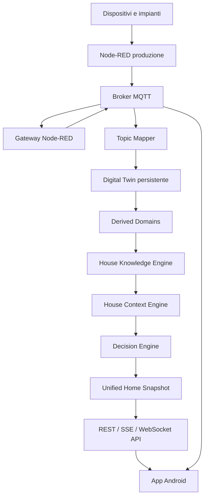

# DomoticsAI — Project Manifest v2

Generato automaticamente: `2026-07-15T22:55:53.760933+00:00`

> Il Manifest descrive l’architettura e i principi del progetto. L’inventario completo è in `PROJECT_INDEX.md`.

## Visione del progetto

DomoticsAI è un assistente domestico locale e self-hosted. Normalizza i dati della casa, costruisce un Digital Twin, interpreta lo stato osservato e produce contesti e suggerimenti consultivi per l’app Android.

Il sistema deve continuare a funzionare senza servizi cloud obbligatori, licenze commerciali o abbonamenti.

## Repository

- Branch: `develop`
- Commit: `bbb1ee5`
- Working tree pulita: `no`
- File modificati: `7`
- File aggiunti: `0`
- File eliminati: `0`
- File rinominati: `0`
- File non tracciati: `11`

## Principi e vincoli

- **Local-first:** server su Raspberry Pi e client su smartphone Android.
- **Offline-capable:** le funzioni domotiche principali non dipendono da Internet.
- **Open stack:** nessuna licenza a pagamento o abbonamento obbligatorio.
- **Self-hosted:** dati, log, storico e configurazioni restano nella rete locale.
- **Safety boundary:** il Decision Engine produce suggerimenti, ma non esegue automaticamente comandi.
- **Explainability:** facts, contesti e decisioni includono motivazioni.
- **Production isolation:** il Node-RED attuale resta invariato fino alla migrazione finale.

## Architettura generale



## Pipeline cognitiva

| Livello | Input | Output | Responsabilità |
|---|---|---|---|
| Digital Twin | MQTT normalizzato | Entità osservate | Rappresentare lo stato reale |
| Derived Domains | Entità osservate | Valori calcolati | Normalizzare e aggregare |
| Knowledge Engine | Twin e derived | Knowledge Facts | Interpretare il significato |
| Context Engine | Facts | House Contexts | Sintetizzare il contesto globale |
| Decision Engine | Facts e contesti | Decisioni consultive | Produrre avvisi e raccomandazioni |
| Home Snapshot | Contesti e decisioni | Snapshot coerente | Alimentare la Home Android |

## Componenti runtime

| Componente | Runtime previsto | Ruolo |
|---|---|---|
| Node-RED produzione | Raspberry Pi | Logica e integrazione impianti esistenti |
| Mosquitto | Raspberry Pi | Trasporto MQTT locale |
| Gateway Node-RED | Raspberry Pi | Normalizzazione e bridge MQTT |
| Core Engine | Raspberry Pi | Twin, conoscenza, decisioni e API |
| SQLite | Raspberry Pi | Persistenza locale |
| App DomoticsAI | Smartphone Android | Interfaccia e controllo utente |

## Core Engine

### Digital Twin

Memorizza lo stato osservato dei domini della casa e lo rende persistente.

### Derived Domains

Calcolano stati energetici e aggregazioni delle luci senza introdurre interpretazioni probabilistiche.

### House Knowledge Engine

Produce facts deterministici e spiegabili tramite reasoner indipendenti per energia, luci, piscina e scenari.

### House Context Engine

Combina i facts in contesti globali quali `SOLAR_SURPLUS`, `POOL_RUNNING` e `SLEEP_MODE_ACTIVE`.

### Decision Engine

Produce avvisi e raccomandazioni. L’esecuzione automatica resta disabilitata.

### Command Manager

Gestisce validazione, pubblicazione MQTT, ACK, timeout, persistenza e storico dei comandi.

### Unified Home Snapshot

L’endpoint `/api/v1/home` restituisce contesti e decisioni costruiti dallo stesso snapshot del dominio `knowledge`.

## Applicazione Android

La Home Android presenta tre livelli:

1. stato di connessione e freschezza;
2. contesti attivi della casa;
3. suggerimenti prodotti dal Decision Engine.

Il client utilizza uno snapshot unificato tramite `HomeIntelligenceViewModel`, mantenendo MQTT come fallback per i dati operativi.

## API Core Engine

| Metodo | Endpoint | Handler |
|---|---|---|
| `GET` | `/api/v1/commands` | `list_commands` |
| `POST` | `/api/v1/commands` | `create_command` |
| `POST` | `/api/v1/commands/lights/{area}/{device_id}` | `command_light` |
| `GET` | `/api/v1/commands/stream` | `stream_commands` |
| `GET` | `/api/v1/commands/{command_id}` | `get_command` |
| `GET` | `/api/v1/context` | `get_context` |
| `GET` | `/api/v1/context/active` | `get_active_context` |
| `GET` | `/api/v1/decisions` | `get_decisions` |
| `GET` | `/api/v1/energy` | `get_energy_view` |
| `GET` | `/api/v1/events` | `get_events` |
| `GET` | `/api/v1/home` | `get_home_snapshot` |
| `GET` | `/api/v1/knowledge` | `get_knowledge` |
| `GET` | `/api/v1/lights` | `get_lights_view` |
| `GET` | `/api/v1/twin` | `get_twin` |
| `GET` | `/api/v1/twin/{domain_name}` | `get_domain` |
| `GET` | `/health` | `health` |

L’inventario tecnico completo è disponibile in [`PROJECT_INDEX.md`](PROJECT_INDEX.md).

## Qualità e test

- Test rilevati: `23` file.
- Endpoint FastAPI rilevati: `16`.
- Topic MQTT rilevati nel codice e nella documentazione: `104`.
- File sorgente e documentali indicizzati: `233`.

## Documenti di riferimento

- [`Architecture/SYSTEM_ARCHITECTURE.md`](Architecture/SYSTEM_ARCHITECTURE.md)
- [`Architecture/CORE_ENGINE_ARCHITECTURE.md`](Architecture/CORE_ENGINE_ARCHITECTURE.md)
- [`Architecture/COMMAND_MANAGER_V1.md`](Architecture/COMMAND_MANAGER_V1.md)
- [`Architecture/PERSISTENT_DIGITAL_TWIN.md`](Architecture/PERSISTENT_DIGITAL_TWIN.md)
- [`AI/AI_ARCHITECTURE.md`](AI/AI_ARCHITECTURE.md)
- [`MQTT/MQTT_TOPICS.md`](MQTT/MQTT_TOPICS.md)
- [`Android/ANDROID_REQUIREMENTS.md`](Android/ANDROID_REQUIREMENTS.md)
- [`Roadmap/ROADMAP_V0_1.md`](Roadmap/ROADMAP_V0_1.md)

## Generazione

```bash
./scripts/update-project-manifest.sh
```

I documenti generati sono:

- `docs/PROJECT_MANIFEST.md`
- `docs/PROJECT_INDEX.md`
